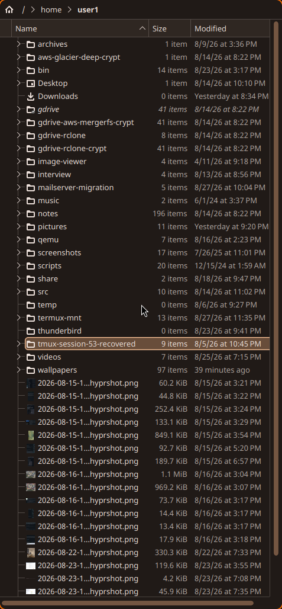
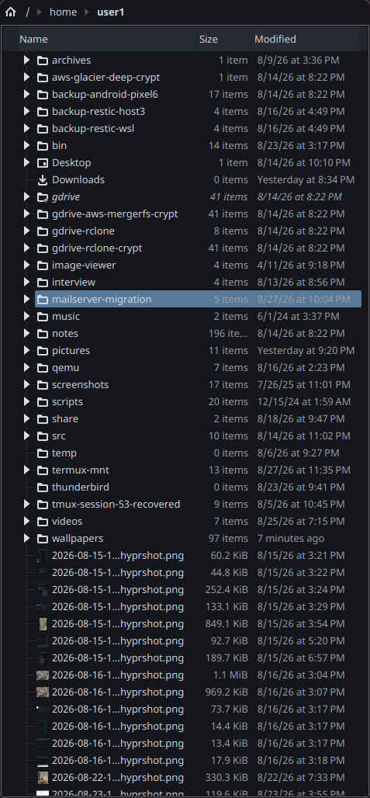

# Theming pipeline

Wallpaper changes drive a Material You (HCT/tonal-palette) recolor across
every themeable app on the system, via `~/.config/hypr/scripts/gen-theme.py`.

## Trigger chain

```
set-wallpaper.sh <image>        <- sole sanctioned way to change the wallpaper
    │  copies image to the fixed path Background.qml displays
    ▼
~/.local/state/quickshell/wallpaper.png changes on disk
    │
wallpaper-watch.sh (polls mtime; autostarted in hyprland.lua)
    │  inotify-tools isn't installed here and installing it needs an
    │  interactive sudo password this autostart script can't provide,
    │  hence polling instead of inotifywait
    ▼
gen-theme.py --image <path>     <- extracts the palette, writes every target below
```

`wallpaper-rotate.sh` (autostarted, "for now" 2026-08-28 testing cadence —
not a considered final value) picks a random image from `~/wallpapers`
every 15 minutes and hands it to `set-wallpaper.sh`, which is what actually
triggers the chain above — nothing extra is needed for colors to follow
along. `wallpaper-cycle.sh` steps forward/back through `~/wallpapers`
(sorted, wrapping) based on wherever `set-wallpaper.sh` last recorded as the
source. `~/wallpapers`, not `~/pictures`, is the rotation pool.

`gen-theme.py` can also run seedless (default), deriving the scheme from
`appearance.lua`'s existing cyan/green accent gradient rather than an
image — used for the quickshell bar's fallback theme values.

## What `gen-theme.py` writes (all atomic: temp file + rename)

| Target | Consumed by |
|---|---|
| `~/.local/state/quickshell/scheme.json` | quickshell bar (`Theme.qml`, live `FileView`). Includes `seriesPalette` (8 hues, per-core/iface lines) and `intensityRamp` (5 calm→hot stops) — see [quickshell-bar.md](quickshell-bar.md) |
| `~/.config/gtk-{3,4}.0/colors.css` | libadwaita `@define-color` block; `gtk.css` is a static `@import "colors.css"` shim. GTK3 live-reloads via `colorreload-gtk-module` (GFileMonitor on mtime — no restart, no flash). GTK4/libadwaita has no live-reload equivalent. |
| `~/.local/share/color-schemes/MaterialYou.colors` + `kdeglobals` `[Colors:*]`/`[WM]`/`[ColorEffects:*]` | Breeze widget style reads the scheme. `gen-theme.py` writes the **complete** key set straight into `kdeglobals` (see [Qt widget style](#qt-widget-style-breeze-not-kvantum)) and fires the `KGlobalSettings` `notifyChange` D-Bus signal — `plasma-apply-colorscheme` short-circuits once `MaterialYou` is current and won't re-copy changed colours |
| Hyprland border colors | via `hyprctl eval` (Lua binding — `keyword` is refused under the non-legacy parser). **Not** written to `appearance.lua` |
| `~/.config/alacritty/colors.toml` | `[colors.primary/normal/bright]`, written whole; `alacritty.toml` imports it (`[general] import = [...]`), `live_config_reload` re-reads imports too |
| `~/.config/rofi/materialyou.rasi` | auto-`@import`ed from `config.rasi` |
| `~/.config/tmux/theme.conf` | sourced from `.tmux.conf`; `tmux source-file` is live |
| `~/.config/nsxiv/xresources` | `Nsxiv.*` X resources, `xrdb -merge`d into XWayland (nsxiv is X11-only); also merged once at Hyprland login since wallpaper-watch may not have fired yet that session |

## What's *not* tracked in git (2026-08-29)

Every pure recolor-output file above is listed in `.git/info/exclude` (not
`.gitignore` — this is a public dotfiles repo, see
[[home_git_repo_public_remote_secrets]]): `gtk-{3,4}.0/colors.css`,
`alacritty/colors.toml`, `rofi/materialyou.rasi`, `tmux/theme.conf`,
`nsxiv/xresources`, `color-schemes/MaterialYou.colors`, `kdeglobals`. These
churned ~8 tracked files on every 15-minute wallpaper rotation before being
excluded. Still tracked: the importers/shims that reference them
(`gtk.css`'s `@import`, `config.rasi`'s `@import`, `.tmux.conf`'s
`source-file -q`, `alacritty.toml`'s `[general] import`) and `gen-theme.py`
itself. On a fresh checkout these regenerate within ~2s of
`wallpaper.png` existing.

## Qt widget style: Breeze, not Kvantum

Qt/KDE apps (Dolphin, Gwenview, Okular, Ark, …) render with the **Breeze**
widget style so they follow the generated `MaterialYou` scheme. This was
**Kvantum** (`darknord-kvantum`) until 2026-08-29 — dropped because Kvantum
themes hardcode their whole palette (`[GeneralColors]` in the `.kvconfig` +
colours baked into the theme SVG) and override the KDE colour scheme
wholesale, so `plasma-apply-colorscheme` had no visible effect on any Qt
app. Kvantum has no stylesheet-overlay mechanism, so it can't be recoloured
live either. `gen-theme.py` now pins `kdeglobals` `widgetStyle=Breeze` each
run.

The screenshot on the left is the **intended post-migration look** for
Dolphin: flat list (no zebra striping — `[Colors:View] BackgroundAlternate`
== `BackgroundNormal`, see below), a slightly lighter breadcrumb/toolbar
band for chrome-vs-content separation, warm hover/selection tint, and the
whole palette tracking the wallpaper.

| Breeze + MaterialYou (current, intended) | Kvantum / darknord (former) |
|---|---|
|  |  |
| flat list, subtle toolbar elevation, follows the wallpaper hue | flat near-black Nord `#14161B`, fixed cool palette, blue folder icons, filled ▶ tree expanders (from the Kvantum SVG — Breeze draws a thin chevron and has no knob for it) |

`color_sections()` in `gen-theme.py` sets `view_alt = view_bg` so list
views don't stripe (the Breeze default read as too strong on warm
wallpapers; darknord had it off entirely). Chrome elevation
(View → Window → Button) is still interpolated `background` →
`surfaceContainer`.

`gen-theme.py` writes the **complete** Breeze key set into `kdeglobals`
`[Colors:*]` (every section + all `Foreground*`/`Decoration*` keys, plus
`[WM]` and `[ColorEffects:*]`) — a partial scheme fills its gaps from
compiled-in Breeze defaults and renders as an incoherent mix. It writes
`kdeglobals` directly (not via `plasma-apply-colorscheme`, which
short-circuits when the scheme name is unchanged) and fires the
`KGlobalSettings` `notifyChange` signal to refresh running apps.

The `darknord-kvantum` theme files are preserved in git history at commit
`02abf2c` (`git show 02abf2c -- .config/Kvantum/`). To restore: reinstall
`kvantum` + `kvantum-qt5`, check the files out, `kwriteconfig6 --file
kdeglobals --group KDE --key widgetStyle kvantum-dark`, and drop the
`widgetStyle` pin in `gen-theme.py`'s `patch_kdeglobals_inline()`.

## Live-reload support per toolkit

| Toolkit | Live? | Notes |
|---|---|---|
| GTK3 | Yes | `colorreload-gtk-module` |
| Qt/KDE (Dolphin) | Yes | Breeze widget style + `KGlobalSettings notifyChange` after a direct `kdeglobals` write — see [Qt widget style](#qt-widget-style-breeze-not-kvantum) |
| GTK4/libadwaita | No | needs restart or a gsettings theme-name bounce |
| GIMP 3 | Only if `gimprc` has `(theme "System")` | set 2026-08-28; `gimprc` is **not** in this repo |
| Inkscape | Yes | follows system GTK theme by default |
| Thunderbird | Partial | Gecko; only GTK-derived chrome bits follow, full theming needs `userChrome.css` |
| Electron/Chromium/Signal | No | never |

See [[gtk_theme_white_root_cause]] memory for a real incident this pipeline
caused (dconf pointing at an uninstalled `adw-gtk3-dark` → white GTK apps)
and its fix.
